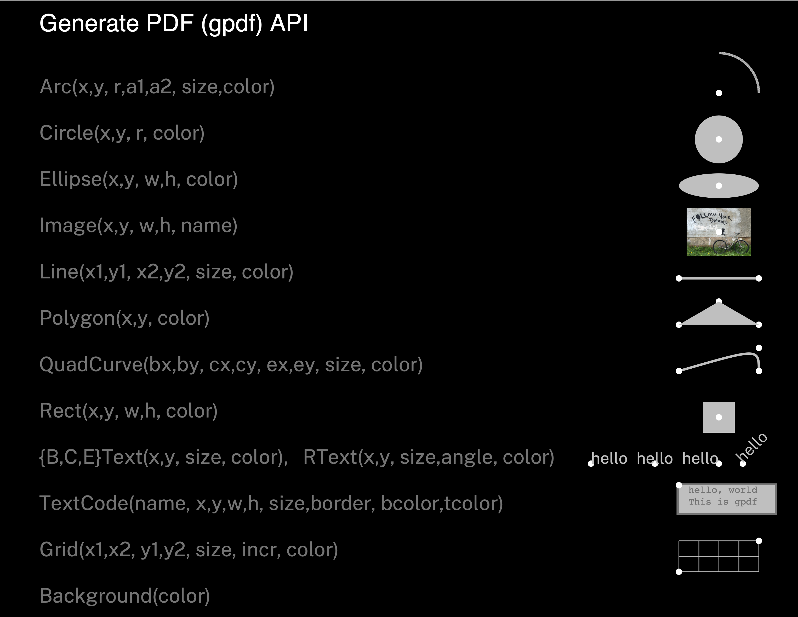
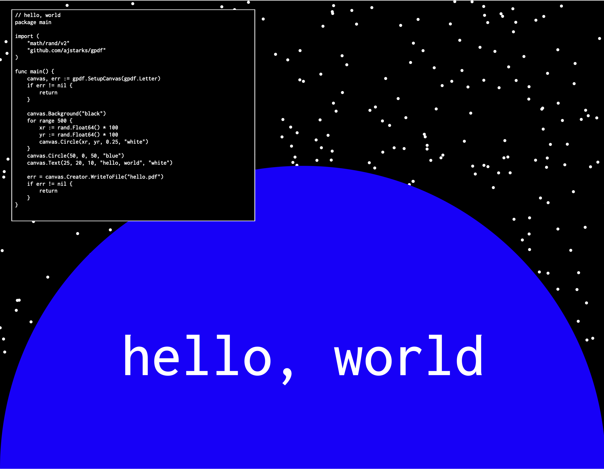

# gpdf
Generate PDF using high-level objects (text, lines, curves, shapes) using a percentage-based coordinate system.

## Initialize

```canvas, err := SetupCanvas(width, height float64) (*Canvas, error)```

## Set page background

```(c *Canvas) Background(color string)```

## Line between (x0,y0) and (x1, y1)

```(c *Canvas) Line(x0, y0, x1, y1, size float64, color string)```

## Filled circle centered at (x,y) with radius r

```(c *Canvas) Circle(x, y, r float64, color string)```

## Filled ellipse centered at (x,y), dimensions (w,h)

```(c *Canvas) Ellipse(x, y, w, h float64, color string)```

## Filled rectangle upper left corner at (x,y), dimensions (w,h)

```(c *Canvas) CornerRect(x, y, w, h float64, color string)```

## Filled rectangle centered  at (x,y), dimensions (w,h)

```(c *Canvas) Rect(x, y, w, h float64, color string)```

## Text beginning at (x,y) at the specified size and color

```(c *Canvas) Text(x, y, size float64, s string, color string)```

```(c *Canvas) BText(x, y, size float64, s string, color string)```

## Text centered at (x,y) at the specified size and color

```(c *Canvas) CText(x, y, size float64, s string, color string)```

## Text end-aligned at (x,y) at the specified size and color

```(c *Canvas) EText(x, y, size float64, s string, color string)```

## Rotated text at the specified angle, anchored at (x,y), with the specified size and color

```(c *Canvas) RText(x, y, size, angle float64, s string, color string)```

## File contents in a box at (x,y) with dimensions (w,h)

```(c *Canvas) TextCode(name string, x, y, w, h, size, linespacing, border float64, bgcolor, txcolor string)```

## Filled polygon with specified coordinates

```(c *Canvas) Polygon(x, y []float64, color string)```

## Quadradic Bezier curve; begin (bx,by), control (cx,cy), end (ex,ey), with specifed stroke size and color

```(c *Canvas) QuadCurve(bx, by, cx, cy, ex, ey, size float64, color string)```

## Circular arc; center at (x,y), radius r, between angles a1 and s2 (degrees), with specifed stroke size and color

```(c *Canvas) Arc(x, y, r, a1, a2, size float64, fillcolor string)```

## Image centered at (x,y), dimensions (w, h)

```(c *Canvas) Image(x, y, w, h float64, name string)```

## Plain and labeled grids between (xmin,ymin) and (xmax,ymax) at the specified increment, using specified size and color

```(c *Canvas) Grid(xmin, xmax, ymin, ymax, size, incr float64, color string)```

```(c *Canvas) LGrid(xmin, xmax, ymin, ymax, size, incr float64, color string)```

## Placemat



## hello, world


