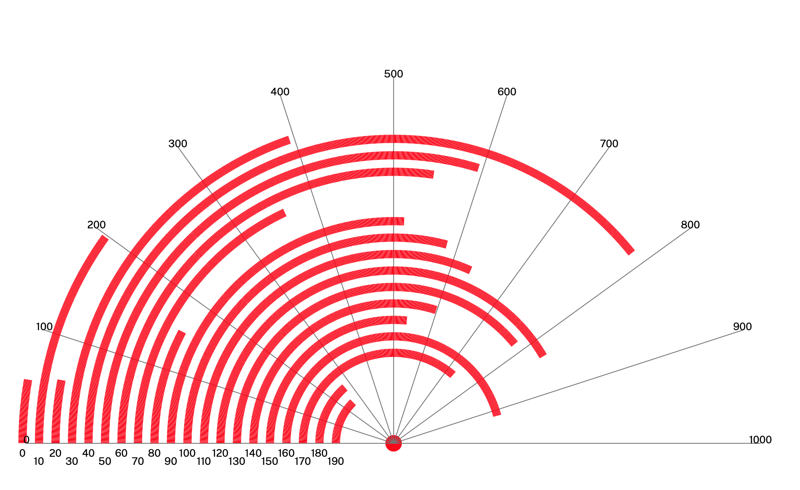

# radbar -- radial bar charts



## options

```radbar [options] [file]```

if no file is specified, read from standard input. PDF output goes to standard output, unless a -o option is used.

input data is tab-separated name,value pairs.  For example:
```
# Standard Data
one     100
two     200
three   300
four    400
five    500
six     600
seven   700
eight   800
nine    900
ten     1000
```

Lines beginning with '#' serve as title.


```
 -color string
        line color (default "steelblue")
  -cx float
        center x (default 50)
  -cy float
        center y (default 40)
  -lw float
        line width (default 0.1)
  -o string
        output file
  -r float
        chart radius (default 45)
  -title string
        title
  -xint float
        x-interval (default 2)
  -yint float
        y-interval (default 10)
  -ymax float
        y-max (default -1)
```

## References

[Three polar diagrams from the Spanish Civil War](https://attilabatorfy.substack.com/p/three-polar-diagrams-from-the-spanish)

